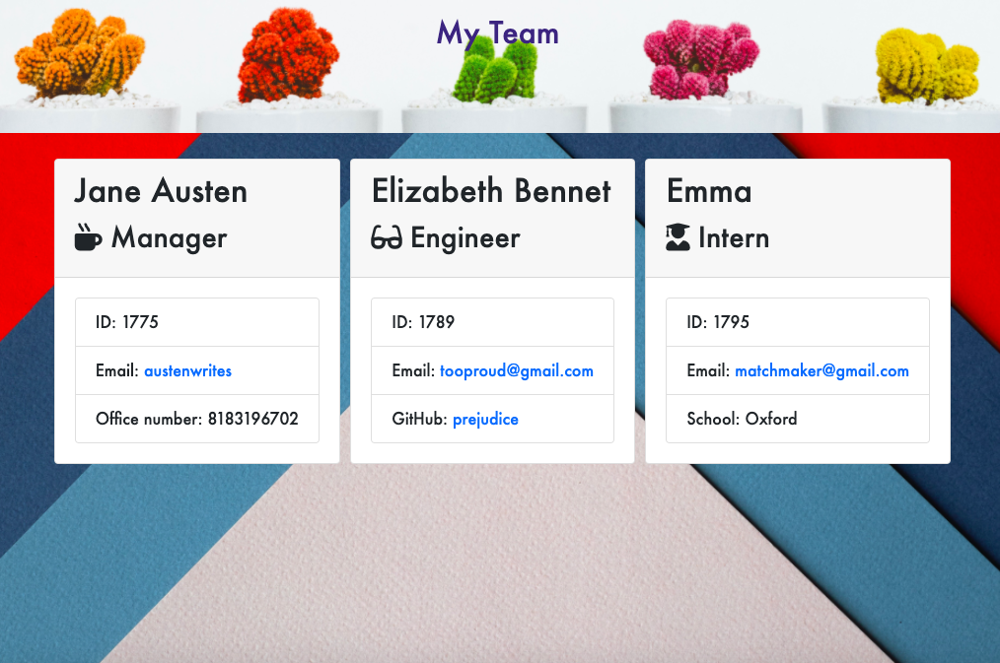

# Team Generator
[](Develop/License/MIT.md)
[](#test)


## Description 

Team Generator is a command-line-interface (CLI) application that allows a user to create a team. The user will be allowed to input information about the team member such as title and employee ID. Once the user answers a series of questions about the employees an html file will be automatically generated. 

This project has helped me gain a better understanding of Object Oriented Programming(OOP) - Encapsulation, Abstraction, Inheritance and Polymorphism. I was also able to explore and gain better understanding of inquirer and testing with jest.


## Table of Contents

* [Technologies](#technologies)
* [Demonstration](#demonstration)
* [Application](#Application)
* [Installation](#installation)
* [Test](#test)
* [Acknowledgements](#acknowledgements)
* [Questions](#questions)

## Technologies

* JavaScript
* Bootstrap
* Node.js
* Inquirer.js
* Jest
* npm
* HTML
* CSS

## Demonstration 

[Application Link](https://drive.google.com/file/d/1X1uUVhLb7KOW-qnKDFIz9N1mOHsrWt2Y/view)


## Application 



## Installation

The following installations are needed for this package:
1. npm init 
2. npm i  
3. npm install inquirer
    
Once in the correct directory (app.js), run "node app.js"


## Test

* To run test, run the following command 

```npm run test```


## Acknowledgements


* [Common templates for user stories](https://en.wikipedia.org/wiki/User_story#Common_templates)
* UW Coding Bootcamp instructional team and classmates
    * test files already provided
    * skeleton of html files already provided
    * htmlRenderer.js already provided
* [Bootstrap](https://getbootstrap.com/docs/4.1/getting-started/introduction/)


## Questions 

If you have any questions, please contact me on:
GitHub at [avaarm](https://github.com/avaarm)
Email at [Armenuhi](mailto:avaarm95@mail.com)

